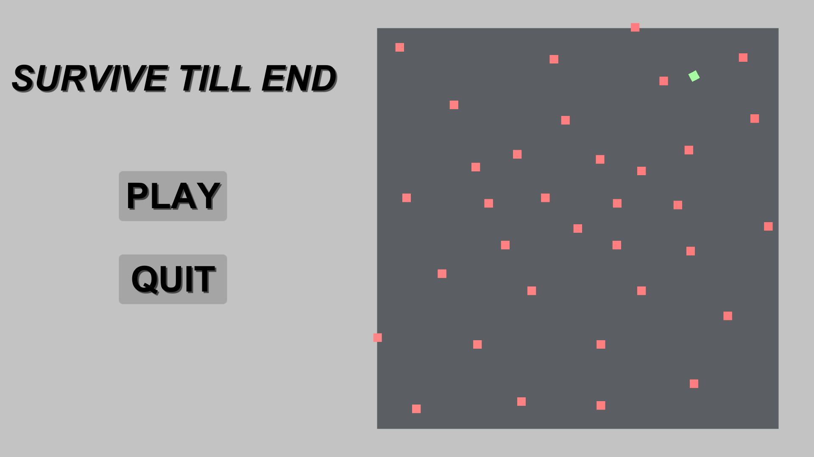
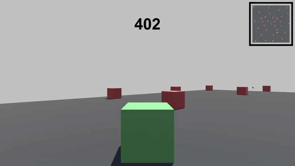

# Survive Till End - Survival Game

Surive Till End is a 3D Survival Game developed in unity engine. In this game you have to survive the Hot Cubes and also be aware of and increasing speed & shrinking ground as time goes on and try to make high score as possible.

It is currently available for Android and Windows.

## Features
- 2D Home Page Mini Game
- Score Count
- Mini Map
- Shrinking Zone

## Experience the Game 
There is Prebuilt Exported Game Ready to play
- Run Game on [Android](https://github.com/devarshukani/SurviveTillEnd-SurvivalGame/tree/master/1%20MOBILE%20GAME%20EXPORT) 
- Run Game on  [Windows](https://github.com/devarshukani/SurviveTillEnd-SurvivalGame/tree/master/2%20WINDOWS%20GAME%20EXPORT)

## Tools and Language Used
- Unity Engine For Game Designing  
- Visual Studio For Logic in C#

## Game Preview

## Contributing
Pull requests are welcome.  
For major changes, please open an issue first to discuss what you would like to change.
